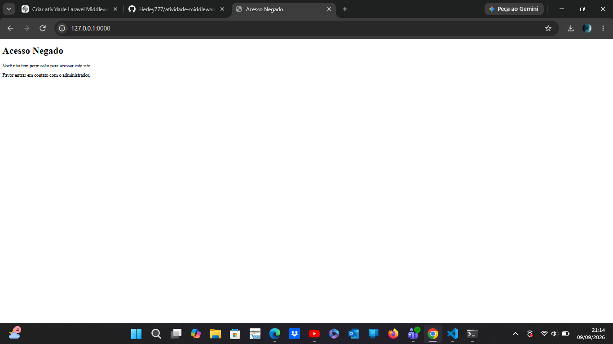

# Atividade Laravel - Middleware

## Objetivo

Criar uma aplicação utilizando o Framework Laravel onde uma rota aciona uma Middleware responsável por verificar a permissão de acesso.

Quando o usuário não possui permissão, a Middleware bloqueia o acesso e apresenta a seguinte mensagem:

> Você não tem permissão para acessar este site.
>
> Favor entrar em contato com o administrador.

---

## Tecnologias utilizadas

* PHP
* Laravel
* HTML
* Blade
* Middleware
* Visual Studio Code

---

## Estrutura do projeto

### Controller

O Controller utilizado é o `SiteController`.

Arquivo:

`app/Http/Controllers/SiteController.php`

O método `index()` é responsável por chamar a página `site`.

```php
public function index()
{
    return view('site');
}
```

---

### Middleware

A Middleware utilizada é a `VerificarPermissao`.

Arquivo:

`app/Http/Middleware/VerificarPermissao.php`

A Middleware é responsável por verificar se o usuário possui permissão para acessar a página.

Caso o usuário não possua permissão, o acesso é bloqueado e a seguinte mensagem é apresentada:

> Você não tem permissão para acessar este site.
>
> Favor entrar em contato com o administrador.

---

### Model

O Model utilizado é o `Usuario`.

Arquivo:

`app/Models/Usuario.php`

O Model representa os usuários cadastrados no sistema e possui o campo `permissao`, utilizado para controlar o acesso.

---

## Rota

A rota utilizada para acessar o sistema está configurada no arquivo:

`routes/web.php`

A rota chama o `SiteController` e utiliza a Middleware `VerificarPermissao`.

---

## Banco de dados

Foi criada uma tabela `usuarios` através de uma Migration.

A tabela possui os seguintes campos:

* `id`
* `nome`
* `email`
* `permissao`
* `created_at`
* `updated_at`

O campo `permissao` é do tipo booleano e possui valor padrão `false`.

---

## Migration

A Migration responsável pela criação da tabela é:

`database/migrations/create_usuarios_table.php`

A estrutura permite armazenar os usuários e controlar a permissão de acesso através do campo `permissao`.

---

## Execução da Middleware

Ao tentar acessar a rota sem possuir permissão, a Middleware bloqueia o acesso e apresenta a mensagem solicitada na atividade.

### Print da execução



---

## Resultado

A aplicação Laravel foi executada corretamente e a Middleware realizou a verificação de permissão.

Quando o usuário não possui permissão, o sistema impede o acesso à página e apresenta a mensagem definida na atividade.

---

## Repositório

Projeto desenvolvido utilizando Laravel para demonstrar o funcionamento de Middleware, Controller, Model, Migration e controle de permissão de acesso.
